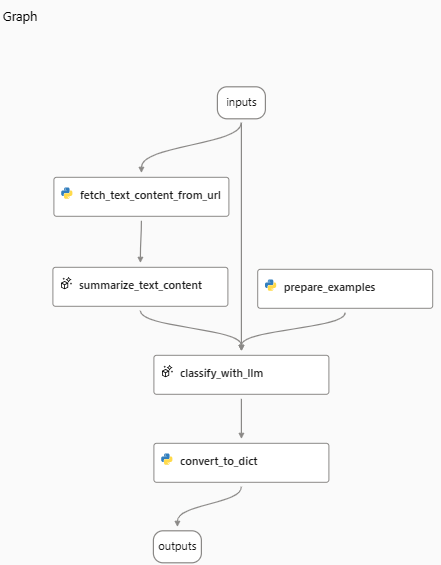
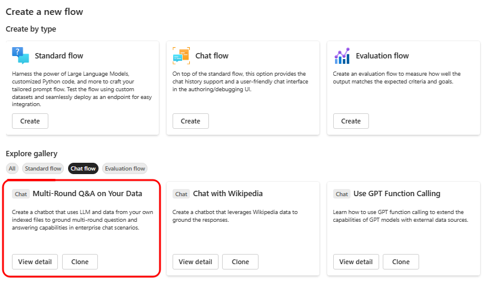
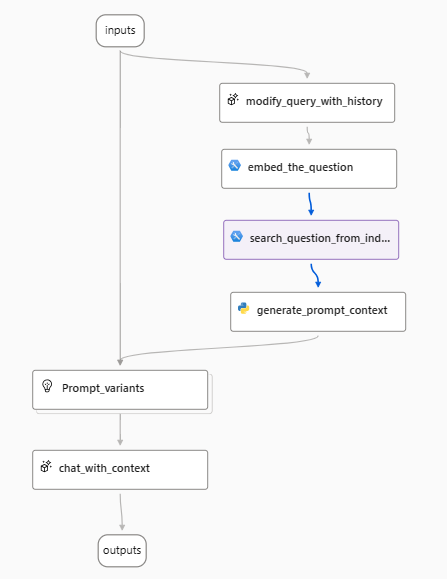
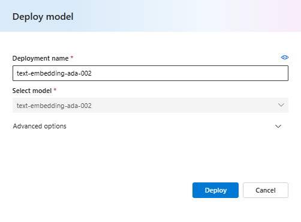
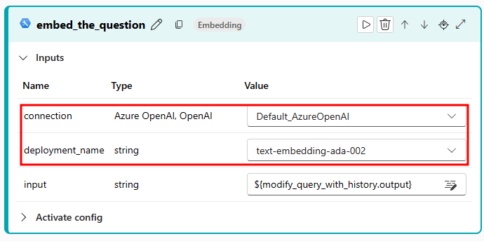
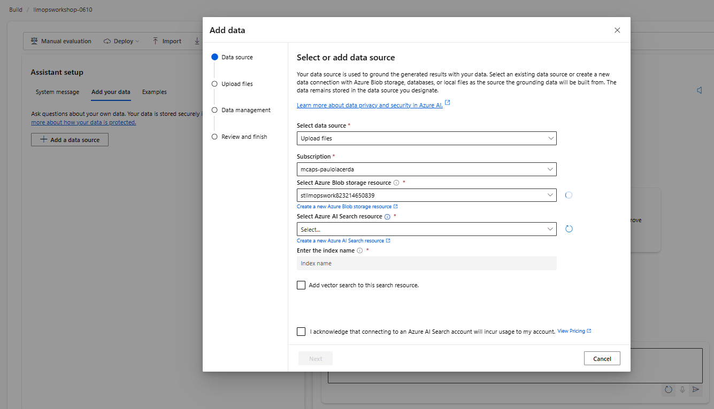
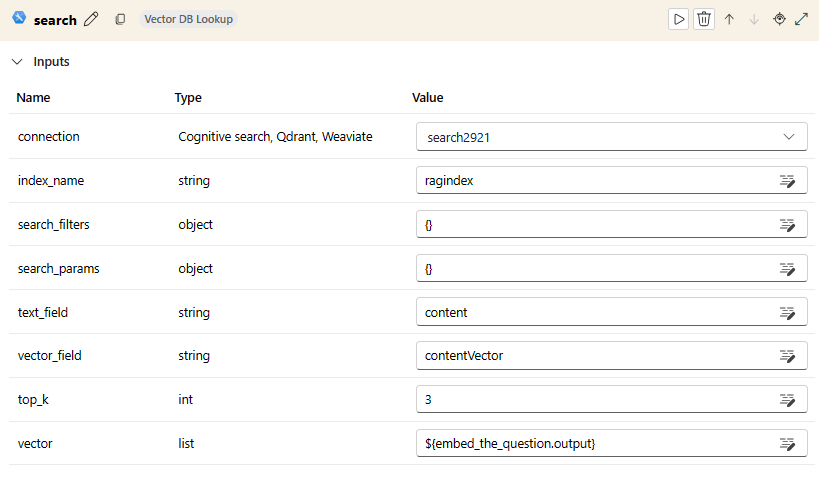
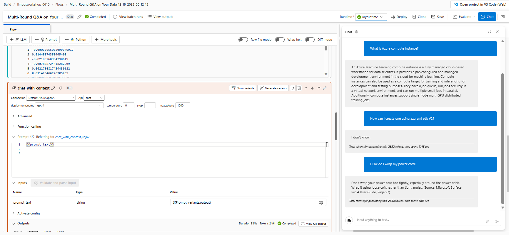

#### Building LLMs Orchestration Flows

Learn how to build prompt flow flows to orchestrate you LLM App.

During this Lab we will go over the following steps:

1) Create a standard classification flow.
2) Create a conversational RAG flow.

#### Setup: Create a project in Azure AI Studio

If you are running this Lab after lesson 1, you don't need to worry about this step.

Otherwise, simply execute step 1 of lesson 1, which is to create a project in Azure AI Studio.

#### 1) Create a standard classification flow

Go to your browser and type: https://ai.azure.com

Enter the **Build** menu and then select the **Prompt flow** option and click on the blue "Create" button.


We will create a flow for classifying websites on the internet, so it will be a Standard flow.

In the flow creation window, select the **Standard flow** filter in the **Explore gallery** section.

Then, click on the "Clone" button in the Web Classification box.


Use the default name for the flow, or if you prefer, define a name of your preference and click on **Clone**.


A Standard flow will be created with the following structure:



Notice that the flow has five nodes, the first `fetch_text_content_from_url` is a python node to extract the text from a Web page.

Then the content obtained by the extraction serves as input for an LLM node `summarize_text_content` to summarize the content.

The summarization, combined with the classification examples generated by a python node `prepare_examples` is the input for another LLM node `classify_with_llm` where the classification is performed.

At the end, we have a Python node `convert_to_dict` responsible for formatting the output of the flow in a python dictionary format.

Now that the flow has been created, in order to run it in the Prompt Flow, we need a runtime for execution.

Select **Start** in the runtime dropdown to start a runtime to run your flow:


After selecting the Runtime, we have to define the Connection with the LLM at each LLM step, which in our case are `summarize_text_content` and `classify_with_llm`.


We will use the `Default_AzureOpenAI` Connection, which connects to the Azure OpenAI resource created when the Azure AI project was created.

If you completed the first lesson, you will have available in this resource a `gpt-4` deployment to select, otherwise create a new deployment as described in *step 2* of *Lab 01*.


Associate the same Connection for the `classify_with_llm` step:


With the Runtime selected and the Connections already configured, you can initiate the flow by clicking on the "Run" button located at the top of the page.


The input used in the flow execution is indicated in its input section.


After finishing the execution you will see that the flow is complete with all steps.


And the result of the processing can be seen in the last node.


#### 2) Create a conversational RAG flow

To create a conversational flow based on the RAG pattern, create a new flow in the Prompt Flow section within the **Build** area.

Select the **Multi-Round Q&A** on Your Data template.



A flow with the following structure will be created.

.

The first node, `modify_query_with_history`, generates a search query based on the user's question and history.

In the second node, `embed_the_question`, we will convert the user's question into an embedding generated by the text-embedding-ada-002 model.

After generating the embedding, we use it to perform the search in a vector store in the `search_question_from_indexed_docs` step, this is when the retrieval of the RAG pattern is performed.

After the search step, the results are combined into a string that will compose the final prompt for the model to generate the answer for the user.

After creating the flow, it will be necessary to update the Connections of the nodes that connect with LLM models.

Starting with the `embed_the_queston` node, as we have not yet created a deployment for an embeddings model yet, it will be necessary to create it.

Click on the "create deployment" button in the **Deployments** section of your project.

This click will take you to the deployment creation page, where you will select the ```text-embeddding-ada-002``` deployment.


You can use the same name of the model in the deployment, as in the following image:



After creating the text-embedding-ada-002 deployment you will be able to select it in the `embed_the_question` node.



Then update the Connection in the `modify_query_with_history` node with the gpt-4 deployment, as indicated below:


And the Connection for the `chat_with_context node` with the gpt-4 deployment, as indicated below:


Now before running your flow, an important step is to create the search index for the Retrieval stage.

The search index is provided by the Azure AI Search service. If you don't have an instance of the service yet, please create one.

To create an instance of the Azure AI Search service, you can easily navigate to the Azure Portal, select the icon "Create a resrouce", search for Azure AI Search and click on Create.


Return to the Playground, choose your `gpt-4` model, and click on the **Add your data** feature. From there, click the "Add a data source" button to initiate the creation of an index for your data. Proceed with the Add Data wizard, where you will upload the PDF `files/surface-pro-4-user-guide-EN.pdf` and select the previously created Azure AI Search resource.



After creating your index, access Prompt Flow and remove the `Index Lookup`` node and add a `Vector DB lookup`` tool to do your search in the Azure AI Search index you just created.

The following image illustrates an example of how to fill in the parameters of the Vector DB Lookup node to access the previously created index.



Now everything is ready for you to run your chat flow.


