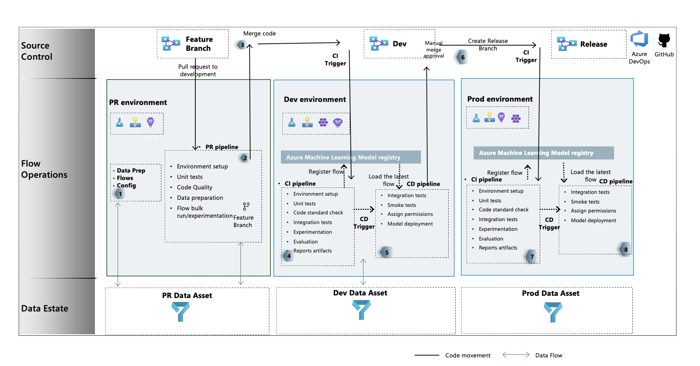

####  Lesson 6: Automating Everything

In this Lab, you will learn how to automate the build, evaluation and deployment of your LLM orchestration flow. To accomplish this, we will use the [**LLMOps with Prompt Flow**](https://github.com/microsoft/llmops-promptflow-template) template as a reference for deploying an LLM using **Prompt Flow** and **Github Actions**.

##### LLMOps with Prompt Flow overview

#### Github Workflows and Prompt Flow flows

The **LLMOps with Prompt Flow** template includes three example use cases: named_entity_recognition, web_classification and math_coding. The examples can serve as a reference for you to automate your own orchestration flow. For each example, a set of GitHub workflows has been provided to automate everything from unit testing to the deployment of the flow. These workflow files are located in the template's `.github/workflows` directory.

In this Lab, we will use the **named_entity_recognition** example, which comes with the following workflows:

The initial workflow, named `named_entity_recognition_pr_dev_workflow.yml`, is automatically triggered whenever a pull request (PR) is created. The primary objective of this workflow is to ensure that the code standards are consistently maintained across all submitted PRs.

The second workflow, named `named_entity_recognition_ci_dev_workflow.yml`, is configured to trigger automatically before a pull request (PR) is merged into the *development* branch. This workflow will perform a comprehensive execution and evaluation across the entire dataset for every prompt variant.

The third workflow, named `named_entity_recognition_post_prod_eval.yml`, is designed to be run manually following the deployment of the Prompt Flow to the production environment. This workflow's purpose is to gather production logs in order to assess the performance of the Prompt Flow in the live setting.

The template example was designed for a branch structure where there is a development branch where the team integrates code changes that go into the development environment. 
 
In this lab, for simplicity's sake, we will only go up to step 5 of the diagram at the beginning of this page, but the knowledge gained can be easily applied to extend the flow and configuration files for automating steps 6 onwards.

#### Lab Steps

We split the lab into two steps; in the first, you will do the necessary setup to run the template, while in the second we will simulate a change in the code of your orchestration flow. Each step can be performed through its respective notebook:

1) [Project setup](lab06_01_project_setup.ipynb)

2) [Making a change in the flow](lab06_02_project_making_a_change.ipynb)

### References

- [LLMOps with Prompt Flow and GitHub](https://learn.microsoft.com/en-us/azure/machine-learning/prompt-flow/how-to-end-to-end-llmops-with-prompt-flow)
- [LLMOps with Prompt Flow template repo](https://github.com/microsoft/llmops-promptflow-template)
- [Basic LLMOps example](https://github.com/Azure/llmops-gha-demo/blob/main/docs/e2e_llmops_with_promptflow.md)
